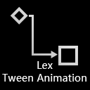

</a>

<h2 align="center">LTween (Lex-Tween) is a tween animation library</h2>

LTween (Lex-Tween) is an easy & fast & efficient tween animation library for UnrealEngine. 
LTween provide many easy functions & blueprint-nodes to help us easily setup tween animation.
All animations in LGUI is made of LTween.

[MarketPlace](https://www.unrealengine.com/marketplace/product/ltween)

## License

[MIT](https://opensource.org/licenses/MIT)

Copyright (c) 2019-present, Lex Liu

## Contact
QQ: 537144721
[Discord](https://discord.gg/JSjB62yTyv)